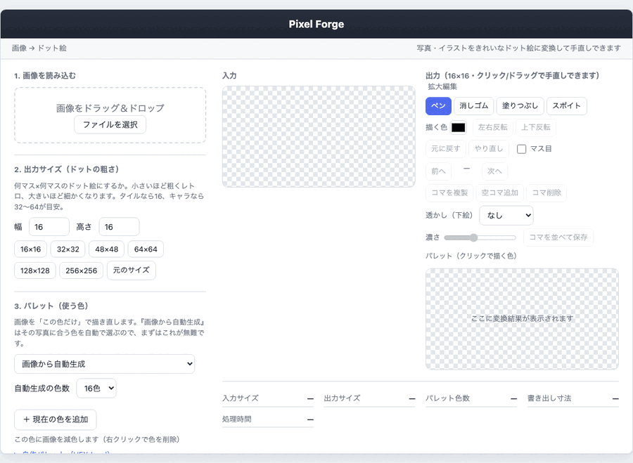

# Pixel Forge 使い方ガイド

写真やイラストを **ドット絵（ピクセルアート）** に変換し、その場で手直し（レタッチ）・アニメのコマ作りまでできるツールです。ブラウザだけで完結し、画像は外部に送信されません。



*↑ 画像を読み込む → 自動でドット絵化 → サイズ/色数を調整 → 拡大編集で手直し → 透かし（下絵）でなぞり描き、までの流れ*

---

## 画面のモード（上部タブ）

画面上部のタブで、やりたいことごとに表示が切り替わります（一度に全部出さず、迷わないように）。

1. **変換**：画像を読み込み（または白紙）、色・サイズを決めてドット絵化。
2. **編集**：ドット絵をペンなどで手直し（大きく表示）。
3. **アニメ**：コマを複数作ってパラパラアニメに（透かし・コマ並べ保存）。
4. **タイルマップ**：作ったコマをタイルとして並べ、マップを作る。

## いちばん簡単な流れ（3ステップ）

1. **画像を読み込む**：左上の枠に画像をドラッグ＆ドロップ（または「ファイルを選択」）。
2. **サイズと色を選ぶ**：初期設定（サイズ16×16／パレット「画像から自動生成」／混ぜ方「なし」）のままでOK。まずは結果を見てみましょう。
3. **PNGで保存**：右下の「PNGを保存」。SNS等で見やすくするなら拡大率は×8前後、素材として原寸で使うなら×1。

これだけでドット絵が作れます。以下は細かく調整したいときの説明です。

---

## 各項目の意味

### 1. 画像を読み込む
変換したい元画像を入れます。大きすぎる画像は自動で縮小して取り込みます。

### 2. 出力サイズ（ドットの粗さ）
何マス×何マスのドット絵にするか。**小さいほど粗くレトロ**、大きいほど細かくなります。
- 目安：タイル＝16、キャラ＝32〜64
- **「元のサイズ」**：読み込んだ画像の解像度そのままで変換・編集できます（縮小したくないとき）。

### 3. パレット（使う色）
画像を「この色だけ」で描き直します。
- **画像から自動生成（おすすめ）**：その写真に合う色を自動で選びます。「自動生成の色数」を増やすほど元画像に近く、減らすほどレトロで色がはっきりします。
- **決まった色（ゲーム機風など）**：Game Boy 風や有名なドット絵パレットを選べます。
- **自作パレット**：HEX（`#1a1c2c` など）や GIMP の `.gpl` を貼り付けて「適用」。
- スウォッチ（色の四角）を右クリックすると、その色を変換パレットから削除できます。

### 4. 色の混ぜ方（ディザリング）
少ない色でグラデーションを表現する方法です。ドットを細かく散らして中間色に「見せる」技術。
- **なし（くっきり）**：いちばん近い色に置き換え。輪郭くっきり。**小さいドット絵はこれが基本**。
- **網目（ベイヤー）**：規則的な網目模様で中間色を表現。均一な質感。
- **粒状（誤差拡散）**：ドットを細かく散らして自然に混色。写真やグラデーション向き。
- 「混ぜ具合」を下げると効果が弱まり、0で「なし」と同じになります。

### 5. 詳細設定
- **縮め方**：なめらか（平均・写真向き）／かっちり（間引き・輪郭が残る）。
- **色の合わせ方**：標準（高速）／高精度（やや遅い）。通常は標準で十分です。

### 6. 書き出し（PNG保存）
ドットのまま拡大して保存できます。「書き出し寸法」に最終的なピクセル数が出ます。

---

## レタッチ（手直し）

変換結果は右側の「出力」でそのまま編集できます。**「拡大編集」**を押すと大きな画面で細かく作業できます。

### 道具
- **ペン**：選んだ色で点を描く（ドラッグで連続）。
- **消しゴム**：なぞった部分を透明に消す。
- **塗りつぶし**：つながった同じ色を一気に塗り替える。
- **スポイト**：画像内の色をクリックして「描く色」に取り込む。
- **描く色**：ペン・塗りつぶしで使う色。編集エリアのパレット（クリックで描く色）や、色ボックスから選べます。
- **左右反転／上下反転**：向き違いのスプライト作成などに。
- **背景切り抜き**：背景を透明にします。**輪郭をきれいにするには「変換」タブで元画像に対して切り抜く**のがおすすめ（縮小前に切り抜くため境界がくっきりします）。編集タブのものは仕上げの微調整用です。
  - **フチから**：画像のフチから続く一様な背景を透明化（写真のスプライト化に最適）。
  - **この色を**：いま選んでいる「描く色」に近い色をすべて透明化（クロマキー）。スポイトで背景色を取ってから押すと確実。
  - 右の **弱/中/強** で「どこまで近い色を消すか」を調整。
- **元に戻す／やり直し**：Ctrl+Z ／ Ctrl+Y。
- **マス目**：ドットの境目にグリッドを表示（位置合わせ用）。

---

## アニメのコマを作る（フレーム＆透かし）

「アニメ」タブで、ゲームのアニメ素材のように複数のコマ（フレーム）を作って再生確認できます。

- **コマを作る**：「コマを複製」（前の絵を引き継ぐ）／「空コマ追加」（白紙）。
- **複数画像を一括取込**：「画像を複数追加」で、4枚などの連番画像をまとめてコマにできます（既に用意したアニメ素材の読み込みに）。
- **タイムライン**：下にコマのサムネが並びます。クリックでそのコマへ。編集中のコマは青枠。
- **再生**：「▶ 再生」でコマを順に表示してアニメを確認（FPSで速さ調整）。編集を始めると自動で停止します。
- **透かし（下絵）**：下に参照画像を薄く敷いて“なぞり描き”。
  - **元画像**：アップした写真を下絵に（右向き→正面、1pxずらし等）。
  - **前のコマ**：直前のコマを下絵に（少しずつ動かす作画に）。
- **コマを並べて保存**：全コマを横1列に並べた1枚のPNG（スプライトシート）で書き出し。

> ヒント：**空コマ追加 → 透かし「元画像」** にすると、元の絵をなぞりながら新しいポーズを一から描けます。

---

## 白紙から一から描く

画像がなくても、**「白紙から作る」**（1の欄）で空のキャンバスを作って一から描けます。
下の「出力サイズ」で大きさを決めてからボタンを押してください（画像がないので、色は固定パレット／自作パレット／色ボックスから選びます）。

---

## タイルマップ（タイルを並べて地図を作る）

描いた**コマ（フレーム）をタイル**として、格子状に並べて大きな絵（マップ／シーン）を作れます。

1. タイルにする絵を **コマ**として用意する（「コマを複製」「空コマ追加」で複数のタイルを作る。地面・壁・草…など）。
2. プレビュー下の **「タイルマップ」** を開く。
3. **列・行**でマップの大きさを決める。
4. **タイルを選ぶ**（一覧から。「空」を選ぶと配置を消せます）。
5. マップを**クリック／ドラッグ**でタイルを敷く（右クリックでそのマスを消去）。
6. **「マップを書き出し」**で1枚のPNGとして保存。

> タイルの大きさ＝コマの出力サイズです。16×16のタイルを並べれば、いわゆるマップチップのシーンが作れます。

---

## よくある質問

- **顔写真がうまくドット絵にならない**
  → パレットは「画像から自動生成」、混ぜ方は「なし」がおすすめ。色数を増やすと精細になります。自動変換は“下地”なので、仕上げはレタッチで手直しするのが基本です。
- **解像度を上げずに保存したい**
  → 書き出しの拡大率を **×1（原寸）** にします。
- **画像はどこかに送られる？**
  → いいえ。すべてブラウザ内で処理され、サーバーには送信されません。

---

## 開発者向け

```bash
npm install
npm run dev        # 開発サーバー
npm run build      # 本番ビルド
npm test           # ユニットテスト（Vitest）
npm run typecheck
```

アルゴリズムの詳細は [README.md](../README.md) を参照してください。
